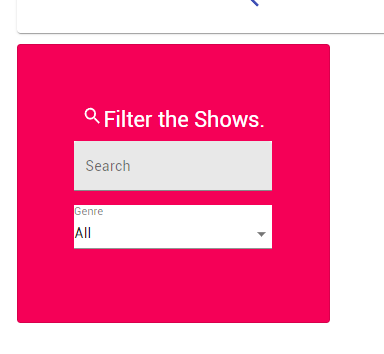
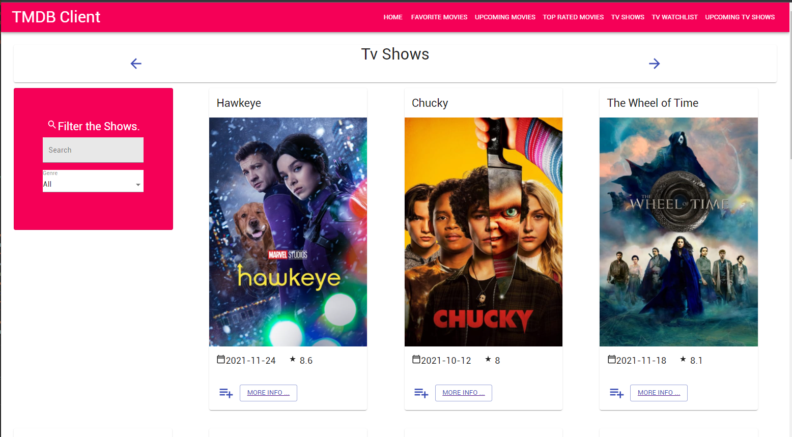
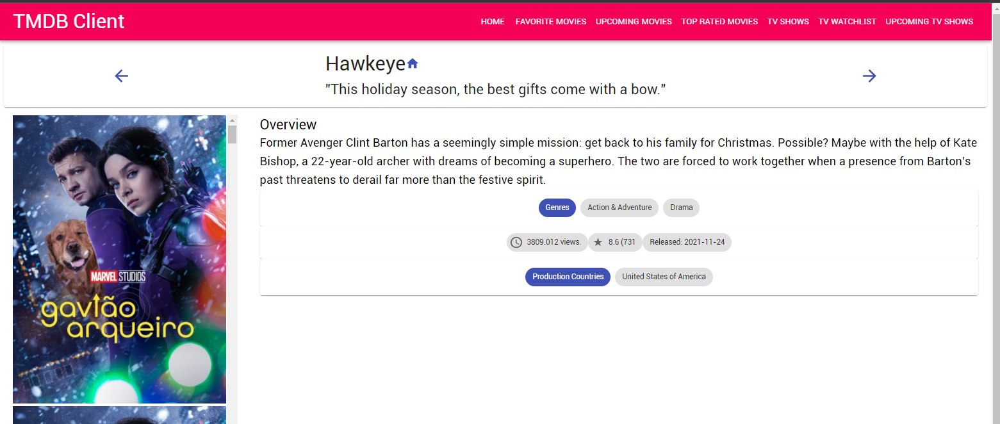

# Assignment 1 - ReactJS app.

Name: Davin Fortune

## Overview.

assignment 1 web app and agile software

### Features.

+ Tv Shows
+ Tv Watchlist + Add to Watchlist
+ Tv Details page
+ Reworked filters card
+ Upcoming Tv Shows
+ Top Rated Movies

## Setup requirements.

npm install
npm start
have no other servers running on port 3000

## API endpoints.

+ Current Tv Shows - discover/tvshows
+ Tv Show Details - tvshows/:id
+ Personal Watchlist - /playlist
+ Upcoming Tv Shows - /upcomingtvshows

## App Design.

### Routing.

+ /tvshows - displays all published tv shows.
+ /tvshows/:id - displays a particular tvshow.
+ /playlist - shows users playlist/watchlist
+ /popularmovies - shows top rated movies
+ /upcomingtvshows- shows upcoming show
 

## Independent learning (If relevant).

